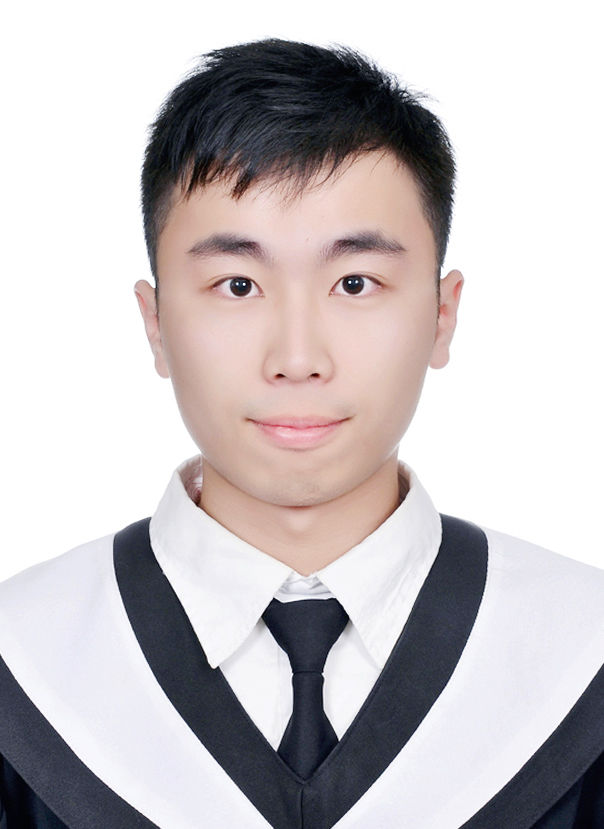

# 陳昌浩 (CHANG-HAO, CHEN)

haoareyou1025@gmail.com

(+886) 901-495-149

# 

## 學歷

* 國立中央大學 電機工程學系碩士班-系統與生醫組 碩士
  2019/9 - 2021/6
  指導教授：李龍豪 博士
  相關專業課程：類神經網路、自然語言處理、生醫影像處理、數位訊號處理

* 國立中正大學 電機工程學系-計算機工程組 學士
  2013/9 - 2017/6
  相關專業課程：微處理機、計算機組織、控制系統、訊號與系統

## 作品

* 碩士論文 - 基於條件式生成對抗網路之資料擴增於思覺失調症自動判別

* ž課程競賽排行榜與答案上傳系統網頁

* 智慧型居家機器人收發信與文字拆解

  

## 技能

* 程式語言

  Python、C、JavaScript、MATLAB

* 人工智慧技術

  Pytorch、Tensorflow、Keras、Scikit-learn、Transformers

* 其他技術 

  Crawler、GUI(Python Tkinter)、Flask、Django

## 競賽經驗

* 國際競賽
  [Social Media Mining for Health Applications (#SMM4H) Workshop and Shared Task 2021](https://aclanthology.org/2021.smm4h-1.18/)

* 國內競賽
  2020 AI CUP [醫病資料去識別化 前標](https://aidea-web.tw/topic/d84fabf5-9adf-4e1d-808e-91fbd4e03e6d)

  2020 AI CUP [愛文芒果五類不良品分類競賽 前標](https://aidea-web.tw/topic/fee8b6d6-dbd1-4794-a091-fa2ad829ea14)

  2021 AI CUP [醫病決策預判與問答 優等](https://aidea-web.tw/topic/3665319f-cd5d-4f92-8902-00ebbd8e871d)

  

## 經歷

* **研究助理** **2020/4 - 2021/6**

  AI 計畫: 應用於居家照護之智慧型互動平台-應用於醫療場域及居家照護之智慧型互動平台-以人工智慧為核心之腦波人機介面開發

  主持人：徐國鎧教授

  共同主持人：李柏磊教授

* **教學助教** **2020/2 - 2020/6**

  課程：深度學習程式設計

  教師：李龍豪 博士

* **研究助理 2019/10 - 2019/12**

  中文醫療健康照護知識庫建置與應用

  計畫主持人：李龍豪 博士

  

## 自傳

* 關於我 

  1994年生，高雄人，現居桃園市，目前就讀於國立中央大學電機工程所碩士班二年級。 專長為機器學習及深度學習應用於生醫影像處理(影像分類、影像生成) 、自然語言處理(命名實體識別、文本分類、文本生成)。 個性善良樂觀、勇於接受挑戰，善於與人交流討論，也喜歡一個人研究問題。時常擔任團隊領導者，帶領夥伴完成任務，在每次做決策中學習成長。 

* 學經歷 

  碩士論文題目：基於條件式生成對抗網路之資料擴增於思覺失調症自動判別 (Automatic Schizophrenia Discrimination using  cGAN-based Data Augmentation) 

  碩士論文主要研究功能性磁振造影 (fMRI) 在知覺失調症患者 (Schizophrenia) 與一般人之間做分類，藉由fMRI所獲得的資料進行不同特徵抽取以研究最佳的分類效果，並使用生成對抗網路生成假資料進行資料擴增提升模型分類效果。 此外，也對自然語言處理 (NLP) 有相當的研究，在命名實體識別 (NER)、文本生成 (GPT) 與文本分類等任務上均有實作經驗。在研究之餘會利用時間觀看各種線上課程及學習程式語言，如：Python、 JavaScript、 C、 Matlab。 

*  發表： 

  Lung-Hao Lee, Man-Chen Hung, Chien-Huan Lu, Chang-Hao Chen, Po-Lei Lee, and Kuo-Kai Shyu, ["Classification of Tweets Self-reporting Adverse Pregnancy Outcomes and Potential COVID-19 Cases Using RoBERTa Transformers,"](https://aclanthology.org/2021.smm4h-1.18/) Proceedings of the Sixth Social Media Mining for Health (# SMM4H) Workshop and Shared Task. 2021, pp.98-101 

  Lung-Hao Lee, Chang-Hao Chen, Wan-Chen Chang, Po-Lei Lee, Kuo-Kai Shyu, Mu-Hong Chen, Ju-Wei Hsu, Ya-Mei Bai, Tung-Ping Su, Pei-Chi Tu, "Evaluating the Performance of Machine Learning Models for Automatic Diagnosis of Patients with Schizophrenia Based on a Single Site Dataset of 440 Participants,"  

* 團隊競賽經驗 

  * 碩士時期：

    * 國際競賽-Social Media Mining for Health Applications (#SMM4H) and Shared Task 2021    
    * 國內競賽-AICUP (醫病決策預判與問答-優等、醫病資料去識別化-前標、愛文芒果五類不良品分類競賽-前標)    

    參與競賽將機器學習與深度學習所學習研究的知識實際應用，在競賽中帶領團隊成員，從一開始做相關資料研究，之後使用各種不同的模型比較效果，並根據不同任務思考，根據資料的特性做不同的處理以提升分數。 

  * 大學時期：

    擔任大學合唱團活動長，籌辦每年舉辦的音樂會，設計不同活動增進團員感情。 

  * 高中時期：

    擔任學生會會長，成為學生與學校溝通的橋樑，為學生爭取福利，並協助學校舉辦活動。

# 

​		Hi, I am studying in the Department of Electrical Engineering, National Central Univerisity. Learning new skills can make me feel fullfilled. People say that I am an easygoing and highly cooperative person. I am kind and optimistic, brave to face challenges, and good at communicating with others. My professional skills are machine learning and deep learning applied to biomedical image processing, natural language processing such as named entity recognition, text classification and text generation.

## 作品集

