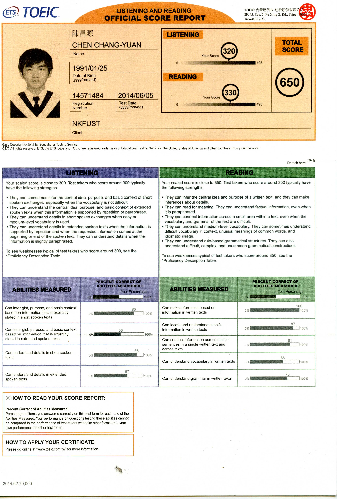
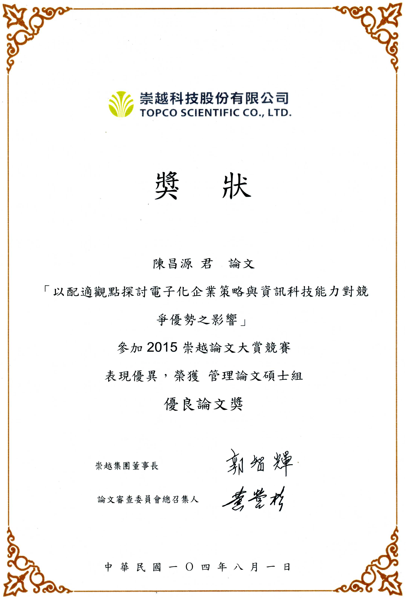
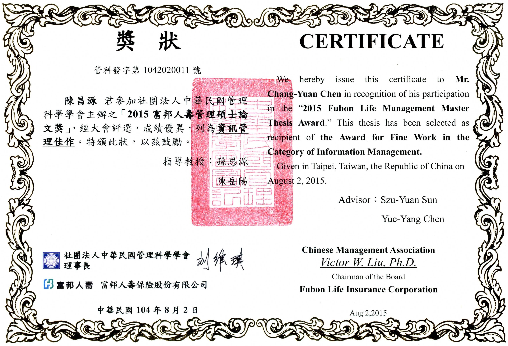
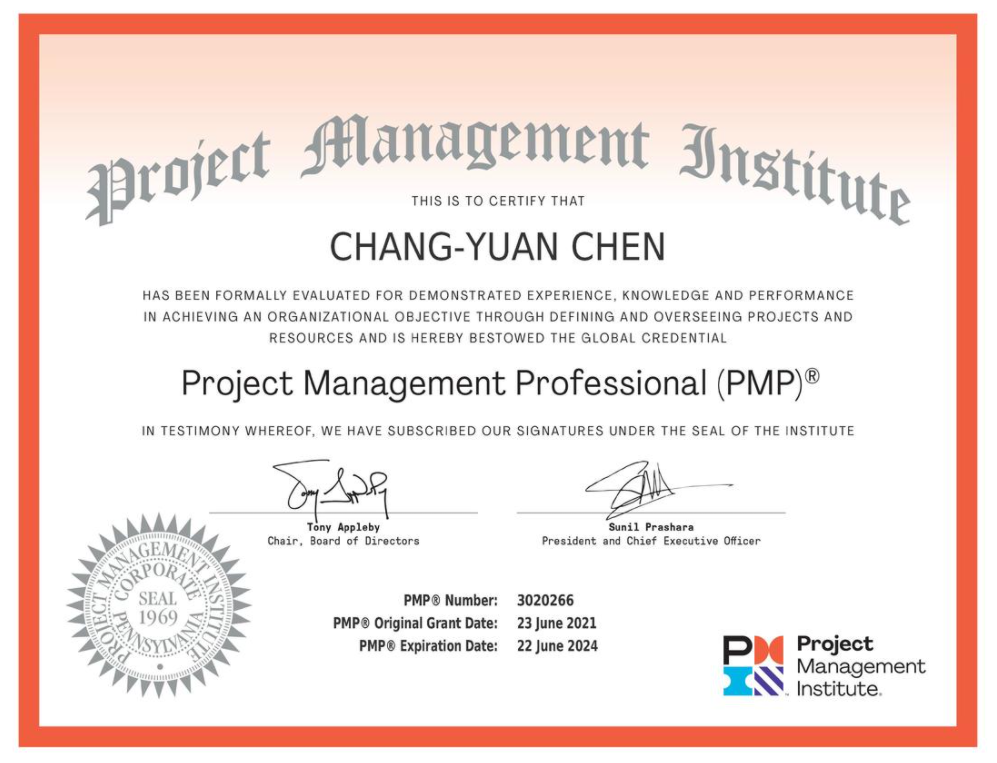

# 陳昌源 

ccyuan125@gmail.com

0931951353

高雄市苓雅區

## 學歷

* 國立高雄第一科技大學

  2013/9~2015/6

  資訊管理系企業電子化研究所 碩士畢業

* 私立義守大學

  2009/9~2013/6

  企業管理學系 大學畢業

  

## 工作經歷

* **長春人造樹脂廠股份有限公司仁武廠**

  **總務管理師**

  2019/6~仍在職

  主業務： 

  1. 總務作業：

     (1)廠區門禁管理(2)清潔外包管理(3)總務改善專案作業(4)總務採購發包作業 

  2. 庫存管理：(1)成品,原物料帳務管理-月/年結帳(2)物料庫存作業改善(3)成品出入庫流程改善(4)新舊物料編碼作業 
  3. 出貨運輸管理：(1)運輸出貨作業(2)外包運輸商管理 
  4. 內部稽核作業：ISO9001,ISO45001,ISO50001,AEO 
  5. 廠區CSR活動：舉行員工活動比賽,淨山淨灘活動 

  支援業務： 

  1. 教育訓練：部門員工教育訓練(日常作業,工安教育) 
  2. 人力資源：支援招考事宜,廠區人員招募作業

* **住華科技股份有限公司**

  **生產企劃工程師**

  2018/3~2019/5

  工作內容：

  1. 規劃生產排程 

  2. 物料規劃 

  3. 客戶訂單確認及管理作業   

  4. 進度催查及管制 

  5. 銷售與生產統計分析

* **正新橡膠工業股份有限公司**

  **生產排程企劃管理師**

  2017/10~2018/3

  工作內容：

  1. 預測銷售量，並擬定生產計畫 

  2. 規劃生產排程 

  3. 物料採購 

  4. 客戶訂單確認及管理作業  

  5. 進度催查及管制 

  6. 銷售與生產統計分析

* **財團法人資訊工業策進會**

  **專案助理**

  2015/3~2015/7

  工作內容：文書處理、廠商連繫、協助活動辦理、協助成果發表會

* **功文文教機構**

  **助理輔導員**

  2010/6~2012/12

  工作內容：課業輔導

  

## 語文能力

* 中文

* 英文

  TOEIC (多益測驗) 650

* 台語

  

## 專長

* 總務作業

  辦公室應用類：Word、PowerPoint、Excel、Outlook ERP：SAP、鼎新

   \#Word  #PowerPoint  #Excel  #SAP  #Outlook 

* 專案管理

  

## 證照

| 證照      | 項目                                            |
| --------- | ----------------------------------------------- |
| TQC / EEC | EEC系列-企業電子化助理規劃師 TQC-DK電子商務概論 |
| Microsoft | MCTS                                            |
| 專案管理  | 國際專案管理師PMP                               |
| 其他證照  | NPMA專案助理                                    |
|           | 甲種職業安全衛生業務主管                        |
|           | 優質企業供應鏈安全專責人員(AEO)                 |
|           | PMP專案管理師認證班                             |

## 自傳

​		我是陳昌源，今年30歲，畢業於國立高雄第一科技大學企業電子化研究所、義守大學企業管理學系，主修企業電子化，亦對於企管產銷人發財皆有涉及。 

​		在出社會第一年的期間，參與了生產管理的工作，生產管理除了最基礎的如期如數，各種資訊系統的應用外，最重要的就是與人溝通互動，在這一年之前的磨練，讓我的工作技能迅速提升，人際互動關係的能力更加扎實。

​		現職為長春石化的高雄廠廠務管理師，職務內容為總務管理、物料管理、倉庫管理、出貨管理、運輸管理、AEO、採購作業、教育訓練、守衛管理與內部稽核擔當、外部稽核對應窗口，小職務並有著多樣、多元性的作業，也因為廠務事務包羅萬象，除了對內上下層的工作，對外部如工業區服務中心、社區鄰里等皆有接洽，不斷考驗著自己如何掌握時間，用最短的時間做出最大化的成果，並達到盡善盡美。 

​		面對新工作的挑戰，我願意多方面嘗試、學習各種領域的工作，並且態度正面，面對各種難題都會想方設法積極地解決，若未來能有幸機會進入貴單位工作，我必定會盡最大的努力及犧牲奉獻的精神付出，為這份工作盡一份心力。

## 證書

